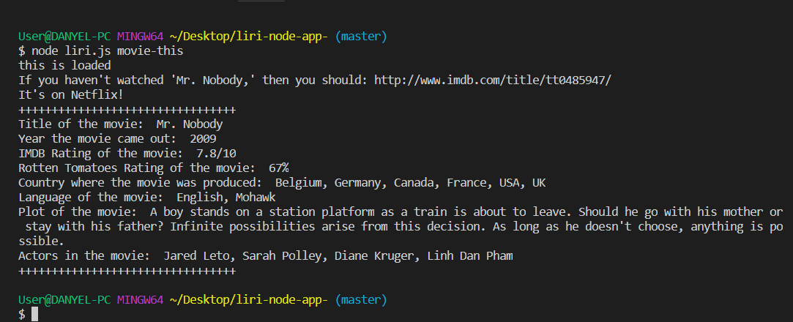
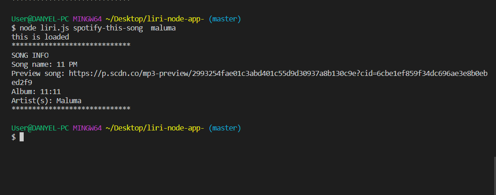
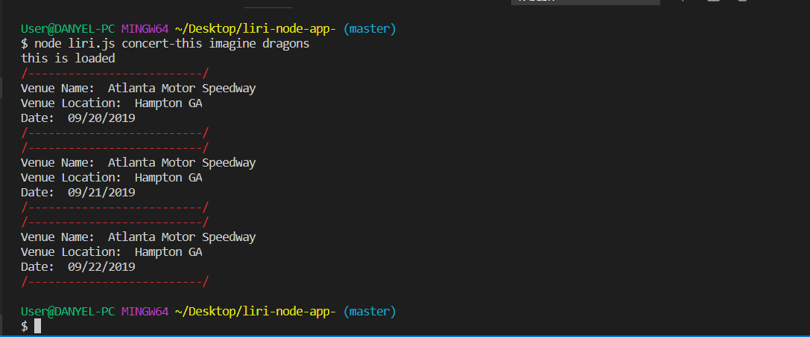

# liri-node-app-

LIRI is like iPhone's SIRI. However, while SIRI is a Speech Interpretation and Recognition Interface, LIRI is a Language Interpretation and Recognition Interface. LIRI will be a command line node app that takes in parameters and gives you back data.

The user has the option of using four commands (listed below) in conjuntion with specific parameters associated with the commands. The Commands are:

* `concert-this`
* `spotify-this-song`
* `movie-this`
* `do-what-it-says`

HOW TO USE LIRI

1. Open your terminal such as Bash.
2. Navigate to the folder that contains the `liri.js` file. 
3. Depending on the command you run, the output will vary. 

Example

node liri.js movie-this <name of movie>

node liri.js spotify-this-song <name of artist or band>

node liri.js concert-this <name of artist or band>

